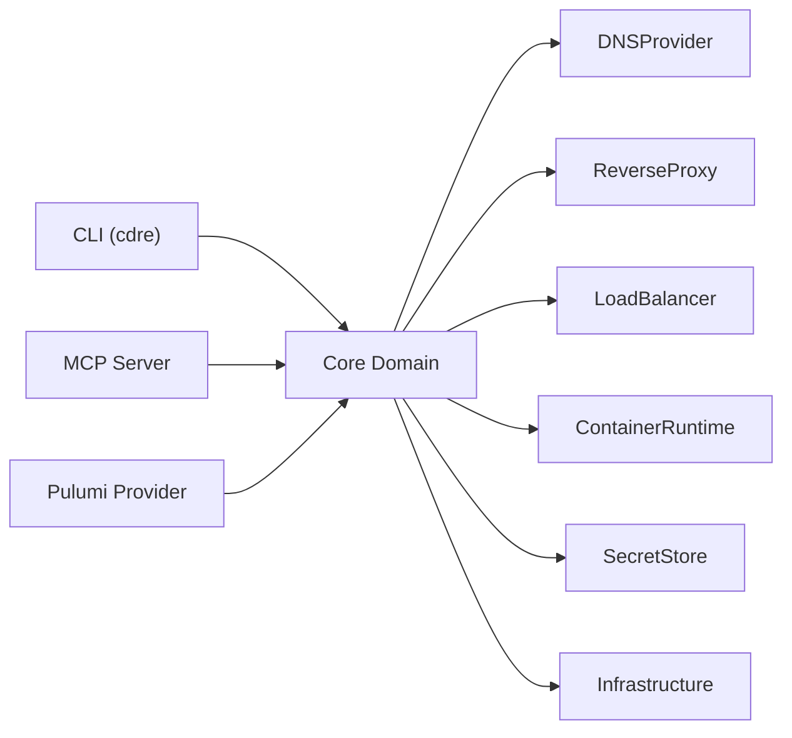

# Hexagonal Port Architecture

## Design Intent

**Context:** Commodore's core domain logic must remain independent of all external systems -- DNS providers, reverse proxies, container runtimes, secret stores -- so that adapters can be swapped without touching the core.

### Goals

- Every external system interaction passes through an explicit port interface
- Adding a new adapter requires implementing one port interface with zero core changes
- The core can be tested in isolation with in-memory adapter stubs
- Port interfaces are self-documenting -- reading the interface tells you what the adapter must do

### Constraints

- No direct imports from adapter code into core code
- Port interfaces define behavior contracts, not implementation details
- Each port has exactly one concern (DNS, ingress, workload, secrets, infrastructure)
- Adapters must not depend on other adapters

### Non-goals

- Adapter hot-swapping at runtime -- adapters are selected at configuration time, not dynamically
- Generic plugin system -- ports are domain-specific, not a general extension mechanism
- Cross-adapter transactions -- each adapter operates independently

## Interface Surface

The hexagonal boundary between Commodore's core domain and all external systems. Six port interfaces define the contracts that adapters implement.

## Contract Definition

### Driven Ports (Outbound)

The core calls these ports to interact with external systems. Each port is a Python protocol (abstract interface) in `src/commodore/ports/`.

| Port | Responsibility | Example Adapters |
|------|---------------|------------------|
| `DNSProvider` | Create, update, delete DNS records | Cloudflare, Route53, OctoDNS |
| `ReverseProxy` | Configure ingress routes and TLS | Caddy, Nginx, Traefik |
| `LoadBalancer` | Manage load balancer targets and health checks | HAProxy, cloud LB |
| `ContainerRuntime` | Deploy, stop, inspect workloads | Docker Compose, k3s, systemd |
| `SecretStore` | Read and write secrets for service consumption | Vault, SOPS, 1Password |
| `Infrastructure` | Provision and query host resources | SSH, Proxmox API, cloud APIs |

### Driving Ports (Inbound)

External actors call into the core through these ports.

| Port | Responsibility | Example Implementations |
|------|---------------|------------------------|
| `CLI` | Human operator interface | `cdre` command-line tool |
| `MCPServer` | Agent-to-agent interface | Future MCP server |
| `PulumiProvider` | IaC integration | Future Pulumi provider |

## Behavioral Guarantees

- **Port isolation:** The core never references concrete adapter types. All interaction is through the port protocol.
- **Single responsibility:** Each port handles exactly one infrastructure concern. A service deployment composes multiple port calls, but no single port crosses concerns.
- **Adapter independence:** Adapters do not call each other. If adapter A needs information from adapter B's domain, the core mediates through its own models.
- **Idempotent intent:** Port methods express desired state, not imperative operations. `dns.ensure_record(record)` not `dns.create_record(record)`.
- **Error boundaries:** Each adapter raises domain-specific exceptions defined by its port. The core translates adapter failures into user-facing diagnostics.

## Integration Patterns

- **Configuration-time binding:** Adapters are selected via topology configuration (YAML). The core resolves which adapter implements each port based on the target host's declared runtime and provider.
- **Protocol-based contracts:** Ports are Python `Protocol` classes. Any class implementing the required methods satisfies the port -- no base class inheritance required.
- **Composition in core:** The core's `plan` and `apply` operations compose calls across multiple ports for a single service. The composition logic lives in the core, not in adapters.

## Evolution Rules

- **Adding a port:** Define the protocol in `src/commodore/ports/`, implement at least one adapter, add the port to the composition layer. No existing code changes.
- **Adding an adapter:** Implement the port protocol in `src/commodore/adapters/<provider>/`. Register it in the adapter registry. No port or core changes.
- **Changing a port contract:** Requires updating all adapters that implement it. Port changes are breaking changes and should be accompanied by an ADR.

## Edge Cases and Error States

- **Missing adapter:** If a service's topology requires a port for which no adapter is configured, `cdre validate` reports the gap before `plan` or `apply` runs.
- **Adapter timeout:** Individual adapter failures surface as port-level errors. The core reports which adapter failed and what operation was attempted, without exposing adapter internals.
- **Partial apply:** When multiple adapters are involved in a single `cdre apply`, a failure in one adapter does not automatically roll back others. The core records which operations succeeded and which failed, enabling idempotent retry.

## Design Decisions

- **Protocols over ABC:** Python `Protocol` (structural typing) chosen over `ABC` (nominal typing) so adapters don't need to inherit from a base class. This keeps adapter code self-contained and testable in isolation.
- **Six ports, not fewer:** DNS, proxy, LB, runtime, secrets, and infrastructure are kept as separate ports despite some overlap (e.g., Caddy can handle both proxy and TLS). Merging concerns would leak adapter capabilities into the port contract.
- **No adapter-to-adapter calls:** Forbidding lateral adapter communication keeps the dependency graph strictly hub-and-spoke. The cost is occasional data duplication; the benefit is that any adapter can be replaced without ripple effects.

## Assets

None yet. Architecture diagrams will be added as implementation progresses.

## Lifecycle

| Phase | Date | Commit | Notes |
|-------|------|--------|-------|
| Active | 2026-04-04 | -- | Seeded from README and VISION-001 architecture |
