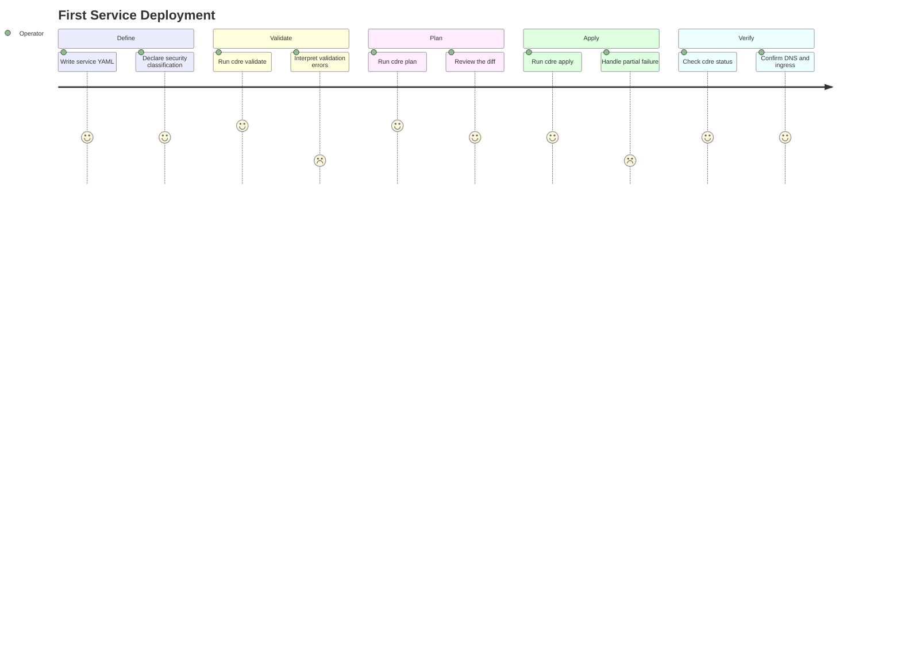

# First Service Deployment

## Persona

[PERSONA-001](../../../persona/Active/(PERSONA-001)-Infrastructure-Operator/(PERSONA-001)-Infrastructure-Operator.md) -- Solo Homelab Operator. A technical professional managing heterogeneous infrastructure who wants to define a service once and deploy it with security classification enforced structurally.

## Goal

Deploy a new service from scratch using `cdre` -- from writing the service definition through validation, placement resolution, and apply -- with security classification enforced automatically.

## Steps / Stages

### 1. Define the Service

The operator creates a YAML file declaring the service's workload, DNS, ingress, storage, and security classification in a single document. This is the first time they express all concerns in one place rather than scattered across multiple config files.

### 2. Validate the Definition

The operator runs `cdre validate` to check the service definition against the topology. The validator catches classification violations (e.g., a custodial workload targeting an operational host) and missing port requirements before anything touches infrastructure.

> **PP-01:** If the topology file is missing or incomplete, the validation error messages don't explain what topology data is needed or where to define it.

### 3. Plan the Deployment

The operator runs `cdre plan` to see what changes will be made -- DNS records, reverse proxy routes, container deployments, secret injections. The plan is a dry-run diff showing the delta between current state and desired state.

### 4. Apply the Deployment

The operator runs `cdre apply` to execute the plan. The platform resolves placement, provisions DNS, configures ingress, and starts the workload through the appropriate adapter for each host.

> **PP-02:** If an adapter fails mid-apply (e.g., DNS provider timeout), the operator has no clear path to retry or roll back the partial deployment.

### 5. Verify the Service

The operator confirms the service is running, reachable via its DNS name, and correctly classified. They check `cdre status` to see the service's placement and health.

## Pain Points

> **PP-01:** Validation errors for topology issues are unclear -- the operator doesn't know what's missing or where to fix it.

> **PP-02:** Partial apply failure leaves infrastructure in an inconsistent state with no obvious recovery path.

### Pain Points Summary

| ID | Pain Point | Score | Stage | Root Cause | Opportunity |
|----|------------|-------|-------|------------|-------------|
| PP-01 | Unclear validation errors for topology issues | 2 | Validate | Error messages reference internal model, not user-facing config | Actionable error messages that point to the specific file and field |
| PP-02 | No recovery path for partial apply failure | 2 | Apply | Adapters execute independently with no transaction coordination | Idempotent apply with per-adapter rollback or retry semantics |

## Opportunities

- **Guided first run:** A `cdre init` command that scaffolds a minimal service definition and topology from an existing Docker Compose or k3s config, lowering the barrier to first deployment.
- **Actionable errors:** Validation and apply errors that reference specific lines in user config files, not internal model paths.
- **Idempotent apply:** Make `cdre apply` safe to re-run after partial failure so the operator can simply retry rather than manually cleaning up.

## Lifecycle

| Phase | Date | Commit | Notes |
|-------|------|--------|-------|
| Active | 2026-04-04 | -- | Seeded from README and VISION-001 |
